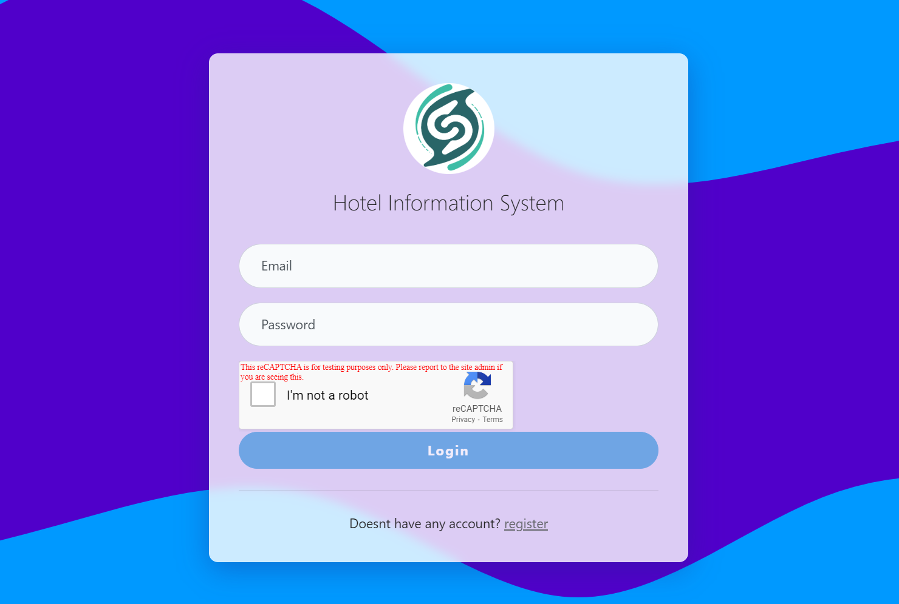

# Hotel-Reservation-Management - For sse group project
- Reservation


- Dashboard


- Login


- Login - failed
  

- Register Customer User
    

- Register Varidation
  
  
  


## Instalation 

### Prerequisites
- Docker: [Install Docker](https://docs.docker.com/engine/install/)

### Build and Run with Docker Compose First time
```
docker-compose up -d --build
```

### Access
- [http://localhost:8000/login](http://localhost:8000/login)


### Login:
 - username: chino@graduate.utm.my
 - password: aoba    

### Run from next time
```
docker-compose up -d (back ground)
```
or 
```
docker-compose up
```

### Stop
```
docker-compose stop
```

### Remove Container
```
docker-compose down
```

## System Flow


## Entity Relationship Diagram


## Static code analysis:
To conduct code analysis, SonarQube was chosen as our tool of choice. It offers comprehensive insights into software quality, enabling early detection and resolution of potential issues. With its ability to assess reliability, maintainability, security, and test coverage, SonarQube streamlines code review processes and prioritizes areas for improvement.
 
### Figure 3 SonarQube dashboard


- Quality Gate Status: The dashboard shows that the Quality Gate Status has “Passed”, suggesting that the analyzed code meets certain predefined criteria for quality.
- Metrics: There are four circular indicators representing different aspects of the code:
  - Security: 0 open issues is indicating no issues found.
  - Reliability: 78 open issues are indicating some concerns.
  - Maintainability: 93 open issues are indicating some concerns.
  - Coverage: 0.0% with a red open circle indicating no coverage data available.
- Additional Metrics: Below these indicators, there are additional metrics:
  - Duplications: 5.0%, represented by two overlapping squares icon.
  - Debt Ratio: 0.992%, represented by a clock icon.
  - Security Hotspots: 3 issues found.
 
### Figure 4  Security Issue 1


- Security Hotspots: The highlighted issue relates to Cross-Origin Resource Sharing (CORS) policy and ensuring resource integrity. CORS is a mechanism that enables the request of various web page resources, such as fonts and JavaScript, from a domain outside its origin domain.
- Priority: The issue has been marked with a low review priority.

 
### Figure 5 Security Issue 2


- Security Hotspots: The highlighted issue relates to that not using resource integrity feature. Resource integrity is a security feature that ensures that the resources fetched by your website are delivered without unexpected manipulation.
- Priority: The issue has been marked with a low review priority.
